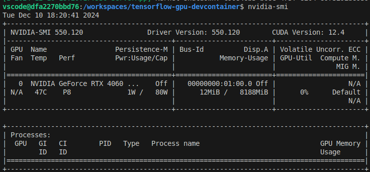

# Development Environment with DevContainer

This template provides a pre-configured development environment using DevContainer, based on an image with TensorFlow and Jupyter pre-installed. It is ideal for those looking to learn and experiment with deep learning projects that require GPU processing in a fully optimized setup.

## Environment Features

- Based on the `tensorflow/tensorflow:2.17.0-gpu-jupyter` image.
- GPU support enabled.
- Pre-configured non-root user (`vscode`) with `sudo` privileges.

## Verifying GPU Support with `nvidia-smi`

To ensure that GPU support is properly configured, you can verify the availability of your GPU using the `nvidia-smi` command. Follow these steps:

1. Open a terminal inside the DevContainer environment.
2. Run the following command:

   ```bash
   nvidia-smi
   ```

3. If GPU support is correctly configured, you should see a table displaying information about your NVIDIA GPU, including its model, memory usage, and other details.<br>


